# Lab2Web
## PHP DASAR
Berikut adalah code untuk membuat "HELLO WORD" 
```
<!DOCTYPE html>
<html lang="en">

<head>
    <meta charset="UTF-8">
    <title>PHP Dasar</title>
</head>

<body>
    <h1>Belajar PHP Dasar</h1>
    <?php
    echo "Hello World";
    ?>
</body>
<h1>Menggunakan Variable</h1>
<?php
$nim = "312110172";
$nama = 'Mufida Nuriyana';
echo "NIM : " . $nim . "<br>";
echo "Nama : $nama";
?>

</html>
```
### **Output**
>Dibawah ini adalah hasil output kita dengan memasukan value kedalam variabel nama dan nim
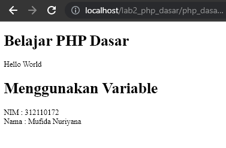<br><br>

## Predefine Variable $_GET
Berikut adalah kode untuk mendapatkan value dari query "nama" dengan menggunakan  $_GET
```
  <h4><b>Predefine Variable</b></h4>
  <?php
  echo 'Selamat Datang ' . $_GET['nama']
  ?>
```

### **Output**
>Dibawah ini merupakan hasil output dengan mengakses url http://localhost/lab2_php_dasar/latihan.php?nama=Mufida 
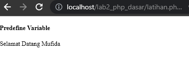

## From Input
Berikut adalah kode untuk membuat from input dengan menggunakan $_POST['nama']
```
<!DOCTYPE html>
<html lang="en">

<head>
    <meta charset="UTF-8">
    <title>PHP Dasar</title>
</head>

<body>
    <h2>Form Input</h2>
    <form method="post">
        <label>Nama: </label>
        <input type="text" name="nama">
        <input type="submit" value="Kirim">
    </form>
    <?php
    echo 'Selamat Datang ' . $_POST['nama'];
    ?>
</body>

</html>
```
### **Output**
>Dibawah ini merupakan hasil output from input dimana mengirim value dengan method post dan diambil menggunakan query 'nama'. Kita bisa mengisi kotak nama dan akan muncul hasill seperti gambar dibawah ini.
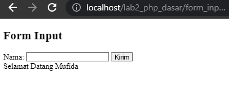

## Operator
Berikut adalah code perhitungan gaji operator
```
<! html DOCTYPE>
<html lang="en">

<Head>
  <meta charset="UTF-8">
  <meta http-equiv="X-UA-Compatible" content="IE=edge">
  <meta name="viewport" content="width=device-width, initial-scale=1.0">
  <Basic ></title>
</Head>

<body>
  <?php
  $Gaji = 1000000;
  $Pajak = 0.1;
  $thp = $Pajak - ($Gaji *  $Pajak);
  Echo "Gaji sebelum pajak = Rp.  $Gaji <br>";
  Echo "Gaji yang dibawa pulang = Rp.  $thp";
  ?>
</body>

</html>
```
### **Output**
>Dibawah ini merupakan hasil gaji operator yang telah dipotoh oleh pajak
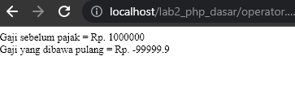

## Kondisi IF
Berikut adalah code dengan menggunakan kondisi IF
```
<! html DOCTYPE>
<html lang="en">

<Head>
  <meta charset="UTF-8">
  <meta http-equiv="X-UA-Compatible" content="IE=edge">
  <meta name="viewport" content="width=device-width, initial-scale=1.0">
  <Basic ></title>
</Head>

<body>
  <h2>Kondisi If</h2>
  <?php
  $nama_hari = date("l");
  if ($nama_hari == "Sunday") {
    Echo "Sunday";
  } elseif ($nama_hari == "Monday") {
    Echo "Monday";
  } else {
    Echo "Tuesday";
  }
  ?>
</body>
```
### **Output**
>Dibawah ini merupakan hasil output dengan menggunakan nama hari sebagai variabel 
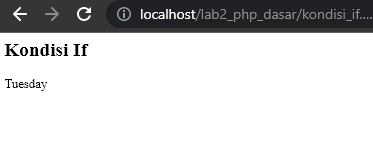

## Kondisi Switch
Berikut adalah code dengan menggunkan kondisi switch
```
<h2>Kondisi Switch</h2>
<?php
$nama_hari = date("l");
Switch ($nama_hari) {
  case "Sunday":
    Echo "Sunday";
    Break;
  case "Monday":
    Echo "Senin";
    Break;
  case "Tuesday":
    Echo "Selasa";
    Break;
  Default:
    Echo "Saturday";
}
Echo "/$nama_hari";
?>
```
### **Output**
>Dibawah ini adalah hasil output dengan menggunakan variabel nama hari
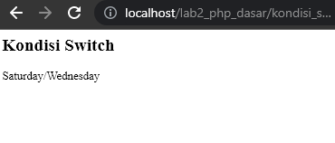

## Perulangan For
Berikut adalah code dengan menggunakan perulangan for
```
  <!DOCTYPE html>
<html lang="en">

<head>
  <meta charset="UTF-8">
  <meta http-equiv="X-UA-Compatible" content="IE=edge">
  <meta name="viewport" content="width=device-width, initial-scale=1.0">
  <title>PHP Dasar</title>
</head>

<body>
  <h2>Perulangan For</h2>
  <?php
  echo "Perulangan 1 sampai 10 <br />";
  for ($i = 1; $i <= 10; $i++) {
    echo "Perulangan ke: " . $i . '<br />';
  }
  echo "Perulangan Menurun dari 10 ke 1 <br />";
  for ($i = 10; $i >= 1; $i--) {
    echo "Perulangan ke: " . $i . '<br />';
  }
  ?>
</body>

</html>
```
### **Output**
>Dibawah ini merupakan hasil output dengan perulangan  1 sampai 10.
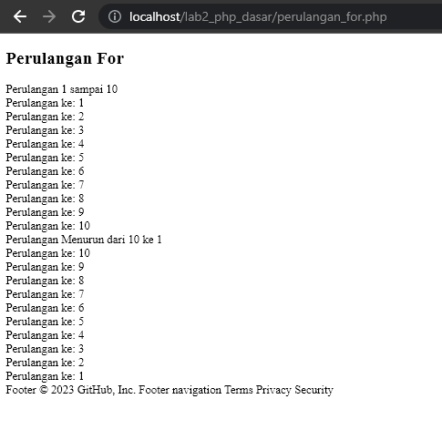

## Perulangan While
Berikut adalah code dengan menggunakan perulangan while
```
<h<h2>Perulangan While</h2>
<?php
echo "Perulangan 1 sampai 10 <br />";
$i = 1;
while ($i <= 10) {
  echo "Perulangan ke: " . $i . '<br />';
  $i++;
}
?>
```
### **Output**
>Dibawah ini merupakan hasil output perulangan 1 sampai 10
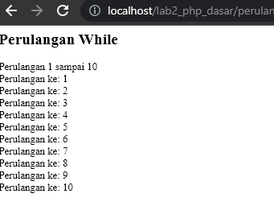

## Perulangan Do While
Berikut adalah code dengan menggunakan do while 
```
<h2>Perulangan Do while</h2>
<?php
echo "Perulangan 1 sampai 10 <br />";
$i = 1;
do {
  echo "Perulangan ke: " . $i . '<br />';
  $i++;
} while ($i <= 10);
?>
```
### **Output**
>Dibawah ini merupakan hasil output perulangan 1 sampai 10
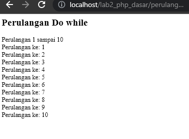

### From Input Sederhana
Berikut adalah code membuat from input sederhana
```
!DOCTYPE html>
<html>
<head>
    <title>Form HTML</title>
</head>
<body>
    <form method="POST">
        <fieldset>
        <legend>Form</legend>
        <p>
           <label for="fNama">Nama: </label><br>
           <input type="text" id="fNama" name="nama"><br>
        </p>
        <p>
            <label>Tanggal Lahir:</label><br>
            <input type="date" name="tanggal" /><br>
        </p>
        <label for="fPekerjaan">Pekerjaan: </label><br>
        <select name="pekerjaan" id="fPekerjaan">
            <option value="Tidak Ada">Tidak ada</option>
            <option value="Admin">Admin</option>
            <option value="Sales">Sales</option>
            <option value="Operator Produksi">Operator</option>
            <option value="Supervisor">Supervisor</option>
            <option value="Manager">Manager</option>
        </select>
        </p>
        <p>
            <input type="submit" name="submit" value="Send" />
        </p>
        </fieldset>
    </form>
    <?php

    if (isset($_POST["submit"])) {
        echo '<h2>Hasil</h2>';
        echo 'Nama:' . $_POST["nama"] . '<br>';
        echo 'Tanggal Lahir:' . $_POST["tanggal"] . '<br>';
        echo 'Usia  :' . date_diff(date_create($_POST["tanggal"]), date_create('today'))->y . "<br>";
        echo 'Pekerjaan :' . $_POST["pekerjaan"] . '<br>';
        if ($_POST["pekerjaan"] == "Admin") {
            echo 'Pendapatan: Rp.  3.500.000 <br>';
        } else if ($_POST["pekerjaan"] == "Sales") {
            echo 'Pendapatan: Rp. 3.000.000 <br>';
        } else if ($_POST["pekerjaan"] == "Operator Produksi") {
            echo 'Pendapatan: Rp. 4.500.000 <br>'; 
        } else if ($_POST["pekerjaan"] == "Supervisor") {
            echo 'Pendapatan: Rp. 5.000.000 <br>';
        } else if ($_POST["pekerjaan"] == "Manager") {
            echo 'Pendapatan: Rp. 5.500.000 <br>';       
        } else {
            echo 'Pendapatan: Rp. 0 <br>';
        }
    }
    ?>
</body>

</html>
```
### **Output**
>Dibawah ini merupakan hasil output dengan menggunakan method $_POST.
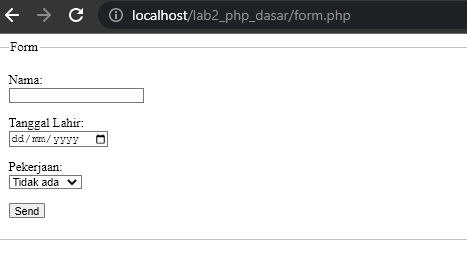
>Dibawah Ini ketika kita memasukan nama,tanggal lahir dan pekerjaan 
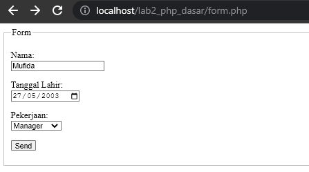
>Dibawah ini merupakan hasil setelah mengisi kolomm nama, tanggal lahir serta pekerjaan akan muncul usia kita serta pendapatan kita sesuai dengan pekerjaan yang dipilih
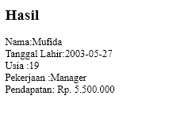
